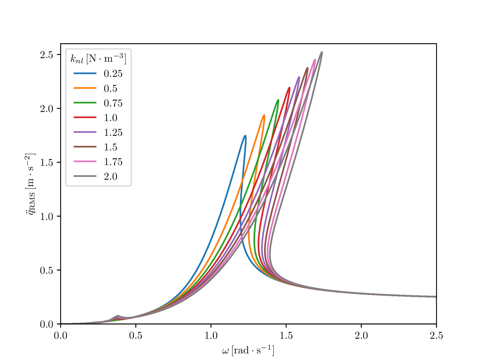

# BO-HBM-ex
[](https://github.com/ragq/BO-HBM-ex) [](https://github.com/ragq/BO-HBM-ex/releases/) [](https://github.com/ragq/BO-HBM-ex/stargazers) [](https://doi.org/10.5281/zenodo.10259290.)


## Description

The Python's tool `BO-HBM-ex` shows an example of the application of Bayesian Optimization [1] on a Duffing problem [2]. The Duffing's oscillator problem is here solved using Harmonic Balance Method and a continuation technique.

<br>
Duffing oscillator scheme. 

The optimization problem can be written:

------------

Find $`(k_{nl}^*,\xi^*)`$ such as 

$`(k_{nl}^*,\xi^*)=\underset{(k_{nl},\xi)\in\mathcal{D}}{\arg\min}\,\underset{\omega\in[\omega_l,\omega_u]}{\max} \ddot{q}_{\mathrm{RMS}}(k_{nl},\xi,\omega)`$

-------------


## Installation

Get the source code from this repository. The example can be run after installation of dependencies with `pip install -r requirements.txt`.


## Usage

The Python's scripts can be run only with Python 3.

### Run solver of Duffing oscillator
The file `respDuffing.py` provides frequencies responses for displacement and acceleration on PDF pictures for $`\xi=\{0.15, 0.3, 0.5, 1.\}`$ ($[\mathrm{kg}\cdot\mathrm{s}^{-1}]$) and $`k_{nl}=\{0.25,0.5,0.75,...,2\}`$ ($[\mathrm{N}\cdot\mathrm{m}^{-3}]$) . Pictures are stored in `ParamDuffing` folder.

Following pictures show $\ddot{q}_ {\mathrm{RMS}}$ for a few values of $k_ {nl}$ for $`\xi=0.15\,\mathrm{kg}\cdot\mathrm{s}^{-1}`$ (a), $`\xi=0.3\,\mathrm{kg}\cdot\mathrm{s}^{-1}`$ (b), $`\xi=0.5\,\mathrm{kg}\cdot\mathrm{s}^{-1}`$ (c) and  $`\xi=1\,\mathrm{kg}\cdot\mathrm{s}^{-1}`$ (d).

(a)|(b)
:---:|:---:
 | 
(c)|(d)
 |  

Animations of $q_ {\mathrm{RMS}}$ (a) and $\ddot{q}_ {\mathrm{RMS}}$  (b) of large set of values of $k_{nl}$ for $`\xi=0.15\,\mathrm{kg}\cdot\mathrm{s}^{-1}`$:

<!-- _{\mathrm{RMS}}$ -->

(a)|(b)
:---:|:---:
 |  

### Run Bayesian Optimization on Duffing oscillator

The file `OptiExp.py` generates data of Bayesian Optimization's iterations. These data will be available on the directory `ExpOptimDuffing` which contains data for sample sets containing 10, 20 and 25 samples. Results are provided along BO iterations on `CSV` files and acquisition and objective functions are plotted in 2D and 3D.

The following pictures show the evolution of the acquisition and objective functions along BO's iterations applied on the Optimization of the Duffing Oscillator (minimization of the maximum of the acceleration along the frequency bandwidth $[0,2.5]$ ($\mathrm{rad}\cdot\mathrm{s}^{-1}$)). The initial sampling obtained with LHS contains 10 sample points.

Acquisition function               |  Objective function
:---:|:---:
 |  
 |  


### Versions

The code has been executed without any issues with the following versions of Python and libraries:
``````
- Python 3.10.9
- numpy 1.26.2
- matplotlib 3.8.2
- pandas 2.1.3
- torch 2.1.1
- botorch 0.9.4
- gpytorch 1.11
- pydoe 0.3.8
``````

## How to cite

This repo is relative to the [PhD thesis](https://www.theses.fr/s263751) of [Quentin Ragueneau](https://www.lmssc.cnam.fr/fr/user/209) achieved at [LMSSC](https://www.lmssc.cnam.fr) under the supervision of [Antoine Legay](https://www.lmssc.cnam.fr/fr/equipe/permanents/antoine-legay) and [Luc Laurent](https://www.lmssc.cnam.fr/fr/equipe/luc-laurent) in collaboration with [Ingeliance Technologies](https://www.ingeliance.com) and founded by [ANRT](https://www.anrt.asso.fr/fr) (Cifre 2020/0272.) 

Please use the following citation reference if you use the code:

`Ragueneau, Q., & Laurent, L. (2023). BO-HBM-ex (v1.0.3). Zenodo. https://doi.org/10.5281/zenodo.102592910`

Bibtex entry:
``````
@software{BO-HBM-ex-soft,
author       = {Ragueneau, Quentin and Laurent, Luc},
title        = {BO-HBM-ex},
month        = dec,
year         = 2023,
publisher    = {Zenodo},
doi          = {10.5281/zenodo.10259290},
url          = {https://doi.org/10.5281/zenodo.10259290}
}
``````
NB: version number and DOI must be adapted from [Zenodo's repository](https://doi.org/10.5281/zenodo.10259290).

## License

MIT License

Copyright (c) 2023 - Quentin Ragueneau (quentin.ragueneau@ingeliance.com)

Permission is hereby granted, free of charge, to any person obtaining a copy of this software and associated documentation files (the "Software"), to deal in the Software without restriction, including without limitation the rights to use, copy, modify, merge, publish, distribute, sublicense, and/or sell copies of the Software, and to permit persons to whom the Software is furnished to do so, subject to the following conditions:

The above copyright notice and this permission notice shall be included in all copies or substantial portions of the Software.

THE SOFTWARE IS PROVIDED "AS IS", WITHOUT WARRANTY OF ANY KIND, EXPRESS OR IMPLIED, INCLUDING BUT NOT LIMITED TO THE WARRANTIES OF MERCHANTABILITY, FITNESS FOR A PARTICULAR PURPOSE AND NONINFRINGEMENT. IN NO EVENT SHALL THE AUTHORS OR COPYRIGHT HOLDERS BE LIABLE FOR ANY CLAIM, DAMAGES OR OTHER LIABILITY, WHETHER IN AN ACTION OF CONTRACT, TORT OR OTHERWISE, ARISING FROM, OUT OF OR IN CONNECTION WITH THE SOFTWARE OR THE USE OR OTHER DEALINGS IN THE SOFTWARE.

## References
```
[1] D. R. Jones, M. Schonlau, and W. J. Welch. Efficient Global Optimization of Expensive Black-Box Functions. Journal of Global Optimization, 13(4):455–492, Dec. 1998.

[2] B. Balaram, M. D. Narayanan, and P. K. Rajendrakumar. Optimal design of multi-parametric nonlinear systems using a parametric continuation based Genetic Algorithm approach. Nonlinear Dynamics, 67(4):2759–2777, Mar. 2012.
```
